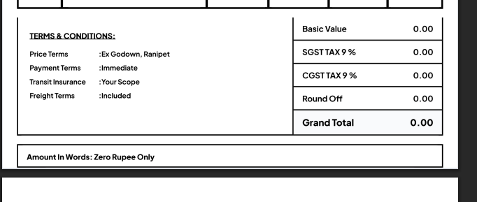

# Professional Quotation & Invoice Management System

A high-end, reactive business tool for generating professional Quotations and Tax Invoices with automated PDF generation.

## 🚀 Key Features

*   **Dynamic Document Modes**: Seamlessly switch between **Quotation** and **Tax Invoice** modes.
*   **Premium Visuals**: State-of-the-art UI with glassmorphism, smooth animations, and optimized typography.
*   **Intelligent Automation**:
    *   Automatic GST (SGST/CGST) and Round-Off calculations.
    *   Smart "Amount in Words" conversion (Indian Numbering System).
    *   Real-time date synchronization.
*   **Advanced Recipient Management**:
    *   Integrated Address Book for quick selection.
    *   On-the-fly entry of new clients.
*   **Professional Output**:
    *   Standard A4 PDF generation with precise margins.
    *   Terms & Conditions inclusion for both document types.
    *   Digital-ready signature and remarks sections.

## 🛠 Project Configuration (Client Handover)

To make customization easy, all company-specific data has been abstracted into a single configuration file.

**File Location:** `src/config.js`

You can update the following without touching the technical code:
*   Company Name & Contact Details
*   GSTIN & PAN Numbers
*   Default Terms & Conditions
*   Tax Rates

## 📥 Getting Started

### Prerequisites
*   Node.js (v18 or higher)
*   npm

### Installation
```bash
# Install dependencies
npm install
```

### Running the Application
```bash
# Start the application
npm start
```
*   **Application URL**: `http://localhost:5173`

## 📐 Technical Architecture

*   **Frontend**: React + Vite (Fast, Modern, Component-based)
*   **PDF Engine**: html2pdf.js (Client-side A4 rendering)
*   **Styling**: Pure CSS with Modern Variable System

---

## 👨‍💻 Maintainer Notes

*   **Logo**: The company logo is located in `public/assets/logo.png`. Replace this file to update the branding.
*   **Calculations**: GST logic is found in the `useEffect` hook within `src/components/QuotationForm.jsx`.
*   **PDF Design**: The print layout is controlled by the CSS in `src/components/QuotePreview.css`.

*Developed by LK Technical Services - Professional Edition*
